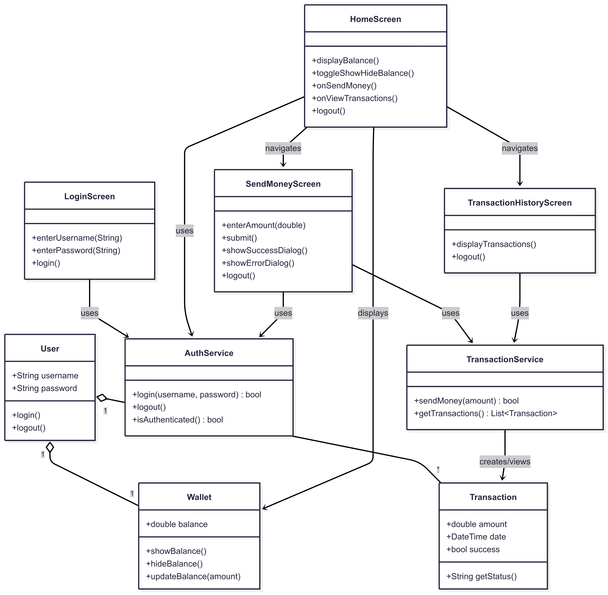
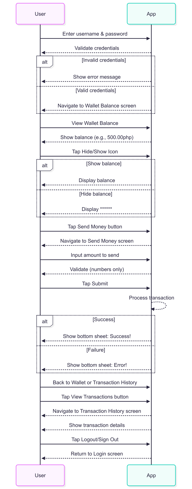
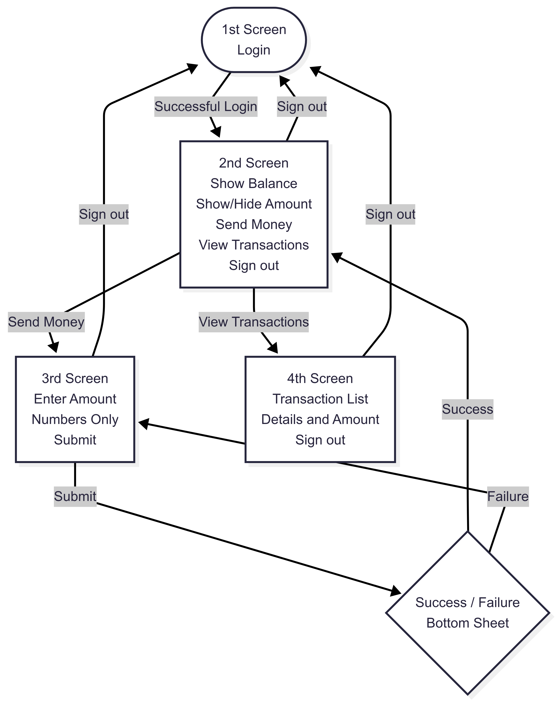

# moneymoneymoney

## FVM (Flutter Version Manager)

**Installation**

Install.

```
brew tap leoafarias/fvm
brew install fvm
```

Activate FVM globally.

```
dart pub global activate fvm
```

**Configuration**

Install Flutter version.

```
fvm install 3.32.7
```

Check installed Flutter versions.

```
fvm list
```

Configure project to use specific version.

```
fvm use 3.32.7
```

**Android Studio**

Go to `Preferences` > `Languages & Frameworks` > `Flutter`
and update the Flutter SDK Path to use FVM path.

```
USER/PATH_TO_FVM/.fvm/flutter_sdk
```

**Reminder**

While using FVM, add `fvm` before any Flutter command.

For example, instead of `flutter pub get`

```
fvm flutter pub get
```

**Refer to these link for more information**

- [Official Documentation](https://fvm.app/docs/getting_started/overview)

- [Medium Article by by Sanjib Maharjan](https://cshanjib.medium.com/setting-up-fvm-flutter-version-management-properly-ab45ade0dd55)


## Getting Started

**Install packages**

```
fvm flutter pub get
```

**Run the generator**

```
fvm dart run build_runner build --delete-conflicting-outputs
```

## Inside the App
**Use this credentials in the app**
```
testuser
123456
```
### Link to mock data source
https://github.com/mengmengmengmeng/monay/blob/main/db.json

### Diagrams
***Class Diagram***

***Sequence Diagram***

***Flow Chart***
